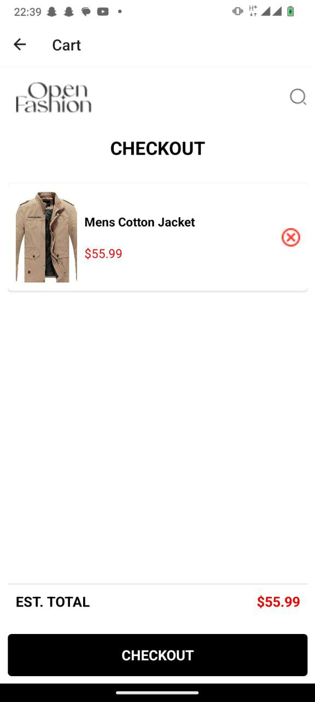

# rn-assignment7-11256031

## Introduction

This is a React Native application developed as part of assignment 7. The application is designed to have the following functionality:
- Users should be able to:
- View a list of available products from external API.
- Preview detail information about a product.
- Add products to their cart.
- Remove products from their cart.
- View the items in their cart..

## Installation

To install the application, follow these steps:

1. Clone the repository: `git clone https://github.com/wtay4/rn-assignment7-11256031.git`
2. Navigate into the project directory: `cd rn-assignment7-11256031`
3. Install the dependencies: `npm install`
4. Run the application: `npm start`

## Sreenshots

